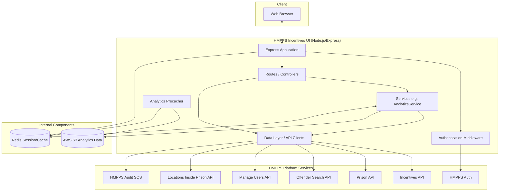

# HMPPS Incentives UI Overview

The HMPPS Incentives UI is a Node.js application that provides a user interface for managing prisoner incentives within the His Majesty's Prison and Probation Service (HMPPS). It allows prison staff to review incentive levels, update them, and view analytics related to incentive distributions and behaviour entries.

## Key Functionality

- **Incentive Reviews**: View and manage incentive levels for prisoners. Staff can see a summary of prisoners in specific locations and their current incentive levels.
- **Prisoner Incentive History**: View the history of incentive level changes for a specific prisoner.
- **Update Incentive Levels**: Authorised staff can change a prisoner's incentive level, providing required details and comments.
- **Incentive Level Administration**:
    - Manage global incentive levels (create, edit, reorder, activate/deactivate).
    - Manage prison-specific incentive levels and their configurations (e.g., default levels, review frequencies).
- **Analytics Dashboard**: View charts and data trends related to:
    - Incentive level distribution by prison, region, or national level.
    - Behaviour entries (positive/negative) over time.
    - Distribution of incentives across protected characteristics to monitor for bias.
- **Location Selection**: Filter and view data based on prison locations and wings.

## External API Integrations

The application communicates with several HMPPS backend services:

| API | Purpose |
| --- | --- |
| **HMPPS Auth** | Authentication and authorization using OAuth2. |
| **Incentives API** | Core service for managing incentive levels, reviews, and prison-specific configurations. |
| **Prison API** | Retrieves prisoner details, location information, and case note summaries. |
| **Offender Search API** | Searches for prisoner records and details. |
| **Manage Users API** | Retrieves user information and roles. |
| **Locations Inside Prison API** | Provides detailed information about locations within a prison. |
| **Nomis User Roles API** | Manages user roles and access within the NOMIS system. |
| **Frontend Components API** | Retrieves common HMPPS header and footer components. |
| **HMPPS Audit** | Sends audit events for key user actions (via SQS). |

## Application Setup

### Tech Stack
- **Language**: TypeScript
- **Framework**: Express.js
- **Template Engine**: Nunjucks with GOV.UK Frontend components
- **Build Tool**: esbuild
- **Testing**: Jest (Unit), Cypress (Integration)

### Infrastructure Components
- **Redis**: Used for session storage and caching (e.g., analytics data).
- **S3 Bucket**: Used for storing and retrieving analytics data files (JSON format).
- **App Insights**: Azure Application Insights for monitoring and logging.
- **SQS**: Used for sending audit messages to the HMPPS Audit service.

### Security
- **HMPPS Auth**: Integrated for user login.
- **Passport.js**: Handles authentication strategies.
- **CSRF Protection**: Implemented using `csrf-sync`.
- **Helmet**: Secures the application by setting various HTTP headers.

### Data Flow for Analytics
The application has a background process (controlled by `server.ts`) that periodically precaches analytics data from S3 into Redis to ensure fast loading of charts in the UI.

## Architecture Overview

